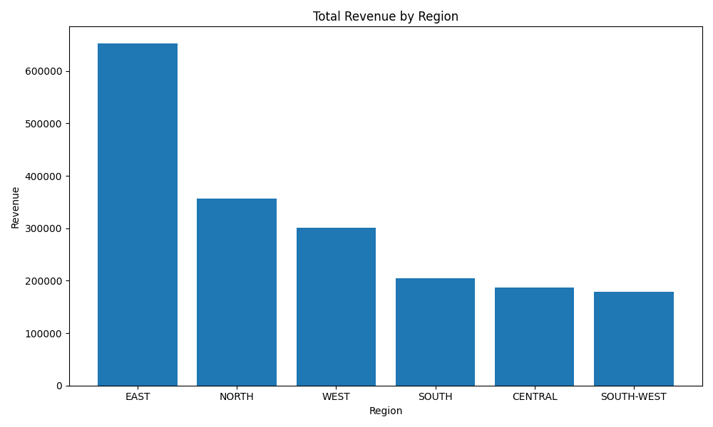

# Pro Analytics 02 Python Starter Repository

> Use this repo to start a professional Python project.

- Additional information: <https://github.com/denisecase/pro-analytics-02>
- Project organization: [STRUCTURE](./STRUCTURE.md)
- Build professional skills:
  - **Environment Management**: Every project in isolation
  - **Code Quality**: Automated checks for fewer bugs
  - **Documentation**: Use modern project documentation tools
  # Pro Analytics 02 — Python Starter Repository

  Use this repository to start a professional Python project.

  - Additional information: <https://github.com/denisecase/pro-analytics-02>
  - Project organization: [`STRUCTURE.md`](./STRUCTURE.md)

  ## Goals

  - **Environment management:** Keep each project isolated.
  - **Code quality:** Use automated checks to reduce bugs.
  - **Documentation:** Build and serve docs with `mkdocs`.
  - **Testing:** Write and run tests with `pytest`.
  - **Version control:** Collaborate using Git and GitHub.

  ---

  ## Workflow 1 — Set Up Your Machine

  Complete the steps in [`SET_UP_MACHINE.md`](./SET_UP_MACHINE.md) and verify your environment before continuing.

  ---

  ## Workflow 2 — Set Up Your Project

  After your machine is configured, follow [`SET_UP_PROJECT.md`](./SET_UP_PROJECT.md) to create and configure this project.

  Typical commands to initialize the project environment (replace with your preferred toolchain):

  ```bash
  uv python pin 3.12
  uv venv
  uv sync --extra dev --extra docs --upgrade
  uv run pre-commit install
  uv run python --version
  ```

  Windows (PowerShell):

  ```powershell
  .\.venv\Scripts\Activate.ps1
  ```

  macOS / Linux / WSL:

  ```bash
  source .venv/bin/activate
  ```

  ---

  ## Workflow 3 — Daily Workflow

  Before starting work each day:

  ### 3.1 Pull latest changes

  ```bash
  git pull
  ```

  ### 3.2 Run checks while you work

  A typical sequence for maintaining the project:

  ```bash
  uv sync --extra dev --extra docs --upgrade
  uv cache clean
  git add .
  uvx ruff check --fix
  uvx pre-commit autoupdate
  uv run pre-commit run --all-files
  git add .
  uv run pytest
  ```

  Note: the second `git add .` ensures that any automatic fixes from linters or pre-commit hooks are staged before committing.

  <details>
  <summary>Best practices note</summary>

  `uvx` runs the latest version of a tool in an isolated cache, outside the virtual environment. For fully reproducible results, or to run a tool inside the project's `.venv`, use `uv run`.

  </details>

  ### 3.3 Build project documentation

  ```bash
  uv run mkdocs build --strict
  uv run mkdocs serve
  ```

  Open the provided local URL in your browser (Ctrl+Click on the link in the terminal). Press `Ctrl+C` to stop serving.

  ### 3.4 Execute demo modules

  Run demo modules to verify functionality:

  ```bash
  uv run python -m analytics_project.demo_module_basics
  uv run python -m analytics_project.demo_module_languages
  uv run python -m analytics_project.demo_module_stats
  uv run python -m analytics_project.demo_module_viz
  ```

  Expected results:

  - Log messages in the terminal
  - Greetings in several languages
  - Simple statistics output
  - A chart window (close to continue)

  If something fails, confirm you are in the project root and that dependencies are installed (`uv sync ...`).

  ### 3.5 Commit and push changes

  ```bash
  git add .
  git commit -m "Describe your change"
  git push -u origin main
  ```

  This triggers CI checks and may publish documentation via GitHub Pages.

  ---

  # Smart Sales — Module 2: Data Preparation

  This module adds a first step of the data pipeline: reading raw CSV files into pandas DataFrames and verifying paths and logging behavior.

  ## What I did

  - Created `src/analytics_project/data_prep.py`.
  - Added a reusable `read_and_log()` function to load CSVs with friendly logging.
  - Set up path constants using `project_root` from `utils_logger.py`.
  - Logged each file load and DataFrame shape.
  - Executed the module with `uv` and verified `project.log` is written.

  ## Raw files loaded

  Located in `data/raw/`:

  - `customers_data.csv` — 201 rows × 4 columns
  - `products_data.csv` — 100 rows × 4 columns
  - `sales_data.csv` — 2001 rows × 7 columns

  ## How to run

  Run the data preparation module:

  ```bash
  uv run python -m analytics_project.data_prep
  ```

  This prints:

  - “Starting data preparation…”
  - Messages about reading each file
  - DataFrame shapes
  - “Data preparation complete.”

  A detailed log is written to `project.log`.

  ## Git commands used

  ```bash
  git add .
  git commit -m "Implement data_prep and update project log"
  git push
  ```

  ## Result

  - Loads all raw data automatically
  - Logs all steps clearly
  - Runs with `uv` and the configured environment
  - Changes are committed and pushed to GitHub


# Smart Sales — Module 4: Data Warehouse (P4)

In this part of the project, I designed and implemented a small data warehouse using a classic star-schema
structure. The goal was to take the cleaned data from P3 and load it into a dimensional model that supports
fast analytical queries.

---

## ⭐ Design Choices

I followed a **star schema** with:

- **dim_customer**
- **dim_product**
- **fact_sales**

This layout keeps the model simple, consistent, and optimized for analysis.
The fact table stores grain-level transactions, while customer and product attributes live in their own
dimension tables.

### Why this schema
- Easy to query for analytics (e.g., totals by region, totals by product category)
- Natural match for the structure of the prepared CSVs
- Clean separation between facts and descriptive attributes
- Works well with SQLite and the course requirements

---

## 🏗 Schema Implementation

The ETL script located at:src/analytics_project/dw/etl_to_dw.py

performs these steps:

1. Creates the warehouse directory and regenerates the database each run.
2. Builds the schema with the correct primary and foreign keys.
3. Reads the prepared CSV files from `data/prepared/`.
4. Normalizes and renames columns to match the DW schema.
5. Removes duplicate `customer_id` rows to avoid PK violations.
6. Loads all three tables using `pandas.to_sql()`.

### DW Schema (SQL)

CREATE TABLE IF NOT EXISTS dim_customer (
customer_id INTEGER PRIMARY KEY,
name TEXT,
region TEXT,
join_date TEXT
);

CREATE TABLE IF NOT EXISTS dim_product (
product_id INTEGER PRIMARY KEY,
product_name TEXT,
category TEXT,
unit_price REAL
);

CREATE TABLE IF NOT EXISTS fact_sales (
sale_id INTEGER PRIMARY KEY,
customer_id INTEGER,
product_id INTEGER,
sale_amount REAL,
sale_date TEXT,
FOREIGN KEY (customer_id) REFERENCES dim_customer(customer_id),
FOREIGN KEY (product_id) REFERENCES dim_product(product_id)
);


---

## 📦 Result: Populated Data Warehouse

After running the ETL, the SQLite database (`data/warehouse/smart_sales_dw.db`) was populated successfully.

### dim_customer
*(Screenshot included in repo)*

### dim_product
*(Screenshot included in repo)*

### fact_sales
*(Screenshot included in repo)*

---

## 🧠 Challenges & Notes

- **Duplicate primary keys:**
  Two `customer_id` values were duplicated in the prepared CSV.
  I added logic to detect and drop duplicates automatically and log a warning.

- **Inconsistent column naming:**
  Some columns were lowercase/uppercase mixes.
  I cleaned all columns using `.str.strip().str.lower()` before renaming.

- Schema alignment:**
  Ensuring the fact table referenced dimension tables correctly required precise
  renaming and column subset selection.

Overall, this module felt very close to what real ETL + DW work looks like — designing,
cleaning, integrating, and validating the pipeline end-to-end.

---

## 🧪 How to Run

From the project root:

uv run python -m analytics_project.dw.etl_to_dw

The script rebuilds the DW and loads all data automatically.

---

## ✔ Git Commit History

git add .
git commit -m "Add data warehouse (P4) + ETL script + populated DW screenshots"
git push

The full DW is now versioned in GitHub.


Smart Sales — Module 5: Cross-Platform Reporting (P5)

In this module, I connected my data warehouse to a BI tool and built interactive analytical views using Power BI Desktop (Windows) via an ODBC connection to smart_sales_dw.db.
The goal was to apply core OLAP operations — slice, dice, and drilldown — and document the reporting process.

🔌 Connecting Power BI to the Data Warehouse

Installed Power BI Desktop and the SQLite ODBC driver

Created a DSN named smart_sales_dw

Loaded the three DW tables: dim_customer, dim_product, and fact_sales

Verified relationships automatically matched the star schema

Built a custom SQL query using Power Query’s Odbc.Query() to create a dedicated reporting table (Top Customers)

Example Power Query code:

let
    Source = Odbc.Query("dsn=smart_sales_dw",
        "SELECT c.name, SUM(s.sale_amount) AS total_spent
        FROM fact_sales s
        JOIN dim_customer c ON s.customer_id = c.customer_id
        GROUP BY c.name
        ORDER BY total_spent DESC;")
in
    Source


The resulting table was loaded as Top Customers for use in visuals.

🔍 OLAP Operations
1. Slice (Filtering by Region)

Since all sales in the dataset share the same date, slicing by date was not meaningful.
Instead, I added a slicer using customer region, which provides real variation across the dataset.

The slicer dynamically filters visuals on the report page.

2. Dice (Two-Dimensional Breakdown)

I created a Power BI Matrix visual with:

Rows: product category

Columns: customer region

Values: Total Sales Amount (a measure created in Power BI)

This reveals how different product categories perform across geographic regions.

3. Drilldown (Year → Quarter → Month)

I built a column chart using a date hierarchy:

sale_date.Year

sale_date.Quarter

sale_date.Month

Power BI allows interactive drilldown even though all records fall within May 2025.
The visual still demonstrates the OLAP hierarchy and navigation between levels.

📊 Visuals Created

Region slicer + bar chart

Product category × region matrix

Drilldown column chart (Year → Quarter → Month)

Top customers ranking table


✔ Git Commands Used
git add .
git commit -m "Add reporting (P5) docs and Power BI summary"
git push

🧠 Result

Successful ODBC connection from Power BI to SQL DW

Clean implementation of slice, dice, and drilldown

Custom SQL query integrated via Power Query

All visuals working interactively

Reporting layer completed and documented

Repository updated with README and DW files (Power BI file not included)


# 📊 P6 – BI Insights & Storytelling
### Goal: Sales Growth by Region

For this module, I focused on a clear business question:
> **Which regions generate the most revenue, and how do they compare?**

The idea is to help a business quickly understand where performance is strongest and where additional attention or investment might be needed.

---

## 1. Business Goal

**Main Question:**
Identify total revenue by region and understand performance differences across geographic areas.

**Why it matters:**
This insight helps guide decisions around marketing, expansion, inventory allocation, and regional growth strategies.

---

## 2. Data Source

The analysis uses:

- The **data warehouse** created in P5 (`smart_sales_dw.db`)
- The **OLAP cube** generated in P6:

`data/olap_cubing_outputs/sales_growth_by_region_cube.csv`

Cube columns:
- `Year`
- `Month`
- `region`
- `TotalRevenue`
- `TransactionCount`

All cube data is derived from:
- `dim_customer`
- `dim_product`
- `fact_sales`

---

## 3. Tools Used

- **Python** (Pandas, Matplotlib)
- **SQLite** as the warehouse engine
- **OLAP-style analysis**: slicing, dicing, and drill-down
- Custom scripts inside `src/analytics_project/olap/`

---

## 4. Workflow & OLAP Logic

### Slicing
Filtered only the necessary fields for regions and revenue.

### Dicing
Grouped by `Year`, `Month`, and `Region` to create a multi-dimensional view.

### Drill-Down
Normalized and consolidated region names to avoid duplicates caused by inconsistent formatting.

### Region Normalization
Examples of cleaning applied:

| Original values       | Normalized |
|-----------------------|-----------:|
| `east`, `EAST`, `East`| EAST       |
| `west`, `West`        | WEST       |
| `south-west`          | SOUTH-WEST |
| `north`               | NORTH      |
| `central`             | CENTRAL    |

### Aggregation


Total Revenue per Region = SUM(TotalRevenue)


5. Results
Below are the outputs generated from the OLAP analysis:

1. Cube Output (Year–Month–Region Aggregation)

This is the cube generated from slicing, dicing, and drilldown.


2. Goal Summary (Total Revenue by Region)

This file contains the cleaned and aggregated revenue per region.


3. Visualization (Bar Chart: Total Revenue by Region)


This chart shows the final insight in a clear, visual format.

6. Suggested Business Actions

Based on the results:

Prioritize EAST — clearly the strongest-performing region.

NORTH and WEST show solid potential; targeted marketing campaigns or inventory optimization could be valuable.

SOUTH, CENTRAL, and SOUTH-WEST underperform relative to other regions; further investigation is recommended.

Align strategic planning and forecasting based on each region’s revenue contribution.

7. Challenges Encountered

Region names were inconsistent (different capitalization and formats).
→ Solved via normalization and grouping logic in the OLAP scripts.

Some records had invalid dates or sale amounts.
→ Cleaned during cubing and transformation with validation steps.

The DW schema differed from the example repository.
→ All scripts were adapted to work with dim_customer, dim_product, and fact_sales.

✅ Final Notes

This completes the full OLAP pipeline for Module 6:
Data Warehouse → Cube → Goal Analysis → Summary → Visualization → Documentation
